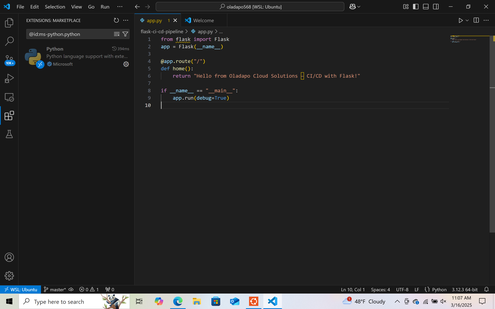

# 🚀 CI/CD Pipeline for a Flask App with GitHub Actions

This project demonstrates how I created a complete CI/CD pipeline using **GitHub Actions** for a simple **Flask web application**. The goal was to automatically test and validate code every time it's pushed to GitHub.

---

## 📌 What I Built

- A Flask app that displays a simple message
- GitHub Actions pipeline that:
  - Creates a Python virtual environment
  - Installs project dependencies
  - Simulates endpoint testing using `curl`

---

## 🛠 Technologies Used

- Python 3.12  
- Flask  
- GitHub Actions  
- Bash (WSL on Windows)  
- Visual Studio Code

---

## 🧱 Step-by-Step Implementation

### ✅ Step 1: Create Project Folder

I created a project folder named `flask-ci-cd-pipeline`.

📸 `01_project_folder_created.png`  


---

### ✅ Step 2: Set Up Python Virtual Environment

The virtual environment failed initially. I fixed it by installing `python3.12-venv`.

📸 `02_virtualenv_fixed_and_activated.png`  


```bash
sudo apt install python3.12-venv
python3 -m venv venv
source venv/bin/activate
```

---

### ✅ Step 3: Install Flask and Freeze Requirements

I installed Flask inside the virtual environment and created a `requirements.txt` file.

📸 `03_requirements_file_created.png`  


```bash
pip install flask
pip freeze > requirements.txt
```

---

### ✅ Step 4: Build the Flask App

I created an `app.py` file that returns a simple message when visited.

📸 `04_flask_app_py_code.png`  


```python
from flask import Flask
app = Flask(__name__)

@app.route("/")
def home():
    return "Hello from Oladapo Cloud Solutions – CI/CD with Flask!"

if __name__ == "__main__":
    app.run(debug=True)
```

---

### ✅ Step 5: Run Flask App Locally to Test

I ran the app locally and tested it in my browser.

📸 `05_flask_app_in_browser.png`  


```bash
python app.py
```

Visit: [http://127.0.0.1:5000](http://127.0.0.1:5000)

---

### ✅ Step 6: Initialize Git and Rename Branch to main

I initialized the repo and renamed the default branch.

📸 `06a_git_branch_renamed.png`  


```bash
git init
git branch -m main
```

---

### ✅ Step 7: Create `.gitignore` File

I excluded environment and cache files.

📸 `06b_gitignore_created.png`  


```bash
venv/
__pycache__/
*.pyc
```

---

### ✅ Step 8: Push to GitHub Using Personal Access Token

I created a new GitHub repo, added it as a remote, and pushed using a PAT.

📸 `13_ci_cd_push_with_token_success.png`  


```bash
git remote add origin https://<username>:<token>@github.com/<username>/<repo>.git
git push -u origin main
```

---

## ⚙️ GitHub Actions CI/CD Workflow Setup

I created a `.github/workflows/ci-cd.yml` file to define the automation pipeline.

📸 `15_ci_cd_workflow_code.png`  


```yaml
name: Flask CI/CD Pipeline

on:
  push:
    branches: [ main ]

jobs:
  build:
    runs-on: ubuntu-latest

    steps:
    - name: Checkout Code
      uses: actions/checkout@v3

    - name: Set up Python
      uses: actions/setup-python@v4
      with:
        python-version: '3.12'

    - name: Install Dependencies
      run: |
        python -m venv venv
        source venv/bin/activate
        pip install -r requirements.txt

    - name: Simulate Test
      run: |
        echo "Simulating test step..."
        python app.py &
        sleep 3
        curl http://127.0.0.1:5000
```

---

## ✅ Pipeline Successfully Running on GitHub

My GitHub Actions workflow triggered automatically when I pushed the code.

📸 `10_github_actions_pipeline_running.png`  


---

## 🔍 Test Output and CI/CD Logs

The output log confirmed that the app was installed and tested successfully.

📸 `16_ci_cd_pipeline_logs_success.png`  


```
Test passed – app installed successfully!
```

---

## ❗ Problems I Faced & How I Solved Them

### 1. Virtual environment creation failed

**Error:** `ensurepip is not available`  
✅ **Fix:** Installed the missing package  
```bash
sudo apt install python3.12-venv
```

---

### 2. Git push failed (403 error)

**Error:** Git tried to use my old GitHub credentials  
✅ **Fix:** I used a personal access token in the remote URL  
```bash
git remote set-url origin https://<username>:<token>@github.com/<username>/<repo>.git
```

---

### 3. Simulate Test step not showing in GitHub Actions

✅ **Fix:** I added the missing step manually in `ci-cd.yml`

---

### 4. VS Code terminal hiding files

✅ **Fix:** Closed the terminal temporarily to see files in the Explorer

---

### 5. GitHub conflict while pushing

✅ **Fix:** Used rebase to pull and merge changes cleanly  
```bash
git pull origin main --rebase
```

---

## 💡 What I Learned

- How to use GitHub Actions for CI/CD  
- How to test Flask apps using `curl`  
- How to resolve Git conflicts and push securely  
- YAML syntax for GitHub workflows  
- Setting up Python environments inside CI

---

## 👤 Author

**Oladapo Adenekan**  
GitHub: [https://github.com/oladapoade](https://github.com/oladapoade)

---

## 💭 Bonus Ideas for the Future

- Add Docker integration  
- Auto-deploy to AWS or Render  
- Integrate with Slack notifications  
- Add `pytest` unit tests for endpoints

---

## ✅ Takeaway

This project sharpened my CI/CD and DevOps skills, strengthened my confidence with GitHub workflows, and proved I can build real-world automation from scratch. 🚀


